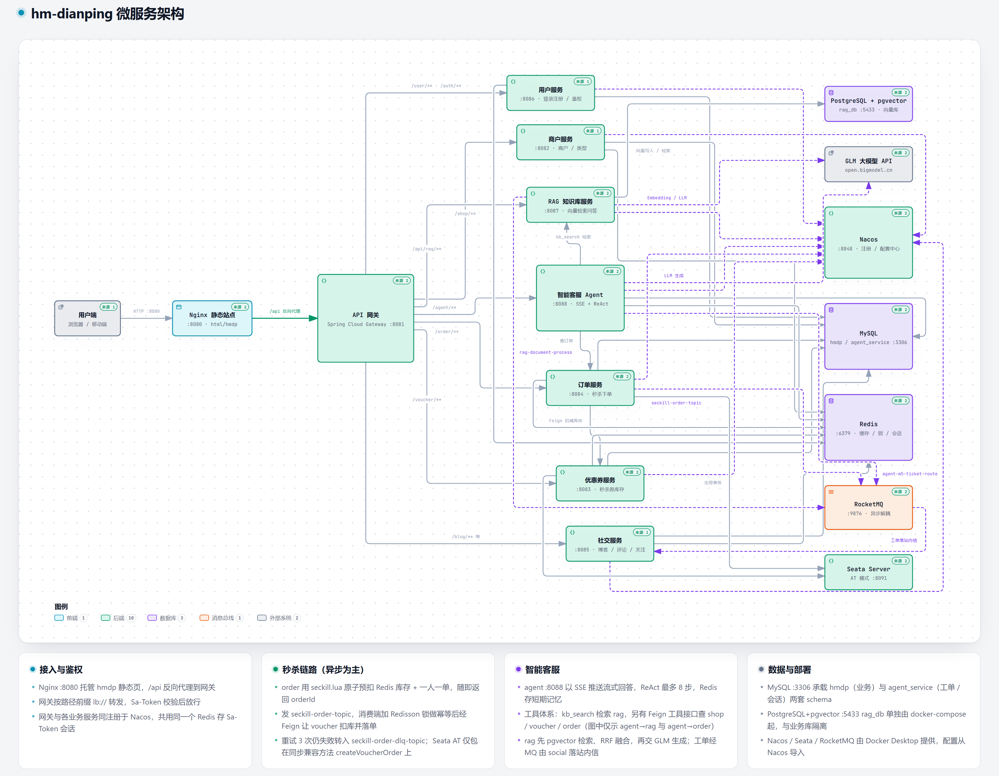

# Live-hub 仿大众点评系统技术文档

## 1. 项目概述

### 1.1 项目简介
Live-hub是一个基于微服务架构的仿大众点评系统，提供用户注册登录、商户信息展示、优惠券发放、订单管理、社交互动、RAG智能问答与智能客服工单Agent等核心功能。系统采用Spring Cloud Alibaba技术栈，实现了高可用、高性能、可扩展的微服务架构。

### 1.2 核心特性
- **微服务架构**：基于Spring Cloud Alibaba的完整微服务解决方案
- **高并发秒杀**：支持高并发秒杀场景，通过Redis+Lua+RocketMQ实现异步削峰
- **分布式事务**：集成Seata实现分布式事务管理
- **缓存体系**：Spring Cache注解 + Redis缓存（Caffeine本地缓存为预留扩展项）
- **统一认证**：Sa-Token + Redis会话共享，网关统一登录校验
- **服务治理**：Nacos实现服务注册发现与配置管理
- **RAG智能问答**：商户知识库上传、混合检索（向量+全文）、SSE流式问答
- **智能客服工单Agent**：ReAct决策、多轮澄清、工单创建流转、转人工协同
- **监控告警**：集成Micrometer、Prometheus实现应用监控

### 1.3 系统架构


## 2. 技术栈

### 2.1 后端技术栈
| 技术栈               | 版本             | 用途                     |
|----------------------|------------------|--------------------------|
| Java                 | 21              | 主要开发语言             |
| Spring Boot          | 3.1.12          | 应用开发框架             |
| Spring Cloud         | 2022.0.4        | 微服务框架               |
| Spring Cloud Alibaba | 2022.0.0.0      | 微服务生态组件           |
| MyBatis Plus         | 3.5.6           | ORM框架                  |
| MySQL                | 8.0             | 关系型数据库             |
| PostgreSQL + pgvector| 16              | RAG向量/全文检索库       |
| Redis                | 6.x             | 缓存数据库               |
| Redisson             | 3.23.3          | Redis客户端框架          |
| Sa-Token             | 1.44.0          | 认证鉴权框架             |
| Seata                | 1.7.0           | 分布式事务框架           |
| Nacos                | 3.1.0           | 服务注册与配置中心       |
| Spring Cloud Gateway | 4.0.5           | API网关                  |
| OpenFeign            | 4.0.5           | 服务间通信框架           |
| RocketMQ             | 4.9.4（服务端） | 消息队列                 |
| GLM API              | glm-5.3-flash / glm-4-flash | LLM（RAG与Agent）|
| Docker               | 20.10+          | 容器化部署               |

> 注意：RocketMQ Spring Boot Starter 2.2.3 在 Boot 3.1 下自动配置不生效，各模块实际固定为 2.3.x starter + 对应 client 版本（详见第 9 章注意事项）。

### 2.2 服务划分
| 服务名称          | 服务端口 | 主要功能                     | 核心数据模型               |
|-------------------|----------|------------------------------|----------------------------|
| gateway-service   | 8081     | API网关、路由转发、登录校验、Agent频控 | -                |
| shop-service      | 8082     | 商户信息、店铺分类、店铺详情 | Shop、ShopType             |
| voucher-service   | 8083     | 优惠券发放、抢购、使用       | Voucher、SeckillVoucher    |
| order-service     | 8084     | 订单创建、退款、查询、对账   | VoucherOrder               |
| social-service    | 8085     | 博客、点赞评论、关注、站内信 | Blog、BlogComments、Follow |
| user-service      | 8086     | 用户登录、个人信息、签到     | User、UserInfo             |
| rag-service       | 8087     | RAG知识库、文档处理、智能问答| KnowledgeBase、Document等  |
| agent-service     | 8088     | 智能客服对话、工单、转人工   | AgentSession、Ticket等     |

> 说明：`common` 模块承载公共实体、工具与全局配置（Sa-Token配置、Redisson配置等）；业务库统一为 MySQL 的 `hmdp` 库，agent-service 使用独立 schema `agent_service`，rag-service 使用 PostgreSQL 的 `rag_db` 库。

## 3. 核心功能模块说明

### 3.1 用户服务 (user-service)
**主要功能**：
- 手机验证码登录（登录时用户不存在则自动注册；密码登录为预留项，暂未实现）
- Sa-Token令牌认证与鉴权（`StpUtil.login`，会话存Redis，各服务共享）
- 用户个人信息管理
- 签到功能（Redis Bitmap实现）
- 用户信息查询

**关键技术**：
- Sa-Token管理登录会话
- Hutool工具类处理验证码
- 网关`SaTokenGatewayConfig`统一校验（白名单：`/user/login`、`/user/code`、`/actuator/**`）

- 分布式ID生成（RedisIdWorker：时间戳 + Redis自增）

### 3.2 商户服务 (shop-service)
**主要功能**：
- 店铺信息CRUD操作
- 店铺分类管理
- 地理位置搜索（Redis GEO，按距离排序）
- 店铺详情缓存（Spring Cache注解）

**关键技术**：
- Spring Cache `@Cacheable("shopCache")` / `@CacheEvict` + Redis CacheManager（TTL 30分钟）
- Redis GEO存储店铺坐标，支持按距离排序的分页查询

### 3.3 优惠券服务 (voucher-service)
**主要功能**：
- 普通优惠券管理
- 秒杀券库存管理
- 优惠券发放与核销
- 库存扣减（数据库+Redis双写）

**关键技术**：
- 数据库乐观锁控制库存
- Redis预减库存提高性能
- 库存同步机制保证数据一致性

### 3.4 订单服务 (order-service)
**主要功能**：
- 秒杀订单创建
- 订单查询（`/voucher-order/my`）
- 退款处理（原子状态机 + actionId幂等）
- 订单与库存一致性对账（`/seckill/consistency/**`：查询、同步、待处理列表、修复）

**关键技术**：
- Lua脚本实现原子性秒杀
- RocketMQ异步处理订单（含死信队列消费者）
- Seata分布式事务
- 分布式锁保证幂等性

### 3.5 社交服务 (social-service)
**主要功能**：
- 博客展示与点赞（点赞/取消点赞）
- 评论查询
- 用户关注与粉丝管理（含共同关注）
- Feed流推送（收件箱分页）
- 站内信通知（`/notification/my`）

**关键技术**：
- Redis ZSet实现点赞（记录点赞时间戳，支持最早点赞排序）
- Sorted Set实现Feed流收件箱
- Redis Set实现共同关注
- 分页查询优化

### 3.6 API网关 (gateway-service)
**主要功能**：
- 统一API入口
- 请求路由与负载均衡
- 跨域处理
- 登录统一校验（Sa-Reactor过滤器）
- Agent接口频控（令牌桶限流）

**关键技术**：
- Spring Cloud Gateway动态路由
- `SaTokenGatewayConfig`全局过滤器实现鉴权
- `AgentRateLimitFilter`仅作用于`/agent/**`，维度为Sa-Token loginId，超出返回429友好JSON（不封禁，次日自然恢复）；Redis故障时fail-open保证可用性

### 3.7 RAG知识问答服务 (rag-service)
**主要功能**：
- 知识库管理（多知识库、商户级权限隔离）
- 文档上传与异步处理（PDF/Word/Excel/TXT/MD → Tika解析 → 语义分块 → GLM Embedding → PgVector存储，经RocketMQ异步）
- 智能问答（混合检索：向量+tsvector全文，RRF融合，GLM生成，SSE流式输出）
- 审计日志（所有操作全记录）
- 内部检索API（供agent-service的`kb_search`工具调用）

**关键技术**：
- PgVector（PostgreSQL 16）向量+全文检索一体
- RRF（倒数排名融合，k=60）混合检索
- GLM Embedding（1024维）+ GLM对话模型
- Apache Tika 2.9文档解析

详见 `rag-service/README.md`。

### 3.8 智能客服Agent服务 (agent-service)
**主要功能**：
- 智能客服对话（SSE流式输出，支持断线重连、SSE降级轮询通道）
- 意图识别与澄清（置信度<0.6触发澄清，最多2轮，第3轮降级菜单）
- ReAct决策（最大8步）调用业务工具：查询我的订单、查询店铺、查询优惠券、按名称搜店、知识库检索
- 多轮记忆（Redis短期记忆TTL 30分钟，超过10轮触发摘要压缩，摘要失败降级保留6轮）
- 工单创建与流转（资金类关键词识别、要素收集、去重合并、状态机流转）
- 退款处理（task原子状态机 + actionId幂等 + 每日对账，不依赖Seata）
- 转人工协同（移交包TTL 7天、坐席工作台接管、等待期消息追加）
- 会话评价、会话快照与90天归档
- 输入安全（敏感词检测与热更新、prompt注入防护）与输出过滤
- 前端埋点统一上报（白名单事件、批量上限20、失败不阻断业务）

**关键技术**：
- 双模型接入：主模型 glm-5.3-flash（查询类回答）、轻量模型 glm-4-flash（意图分类/直答/摘要/ReAct决策），GLM密钥走环境变量
- SSE异步线程模型（sseExecutor异步执行，不阻塞Tomcat线程；降级轮询请求线程限时等待3s）
- 独立schema `agent_service`，网关新增agent-route，手术式新增不改既有秒杀/事务链路
- Feign工具调用超时上限2s（kb_search向量检索放宽至5s）

## 4. 关键代码实现细节

### 4.1 秒杀系统核心实现

#### 4.1.1 Lua脚本原子性操作
`order-service/src/main/resources/seckill.lua` 实现库存预扣减和一人一单校验（返回值：0-成功，1-库存不足，2-重复下单）：

```lua
local voucherId = ARGV[1]
local userId = ARGV[2]
local orderId = ARGV[3]

-- Redis Key定义
local stockKey = 'seckill:stock:' .. voucherId
local orderKey = 'seckill:order:' .. voucherId
local orderDetailKey = 'seckill:order:detail:' .. voucherId

-- 1. 检查库存是否存在/充足
local stock = tonumber(redis.call('GET', stockKey))
if stock == nil then return 1 end
if stock <= 0 then return 1 end

-- 2. 检查是否重复下单（一人一单）
if redis.call('SISMEMBER', orderKey, userId) == 1 then
    return 2
end

-- 3. 扣减Redis库存、记录已购用户、存储订单详情、加入待处理队列
redis.call('DECR', stockKey)
redis.call('SADD', orderKey, userId)
redis.call('HSET', orderDetailKey, orderId, cjson.encode({voucherId=voucherId, userId=userId, orderId=orderId}))
redis.call('LPUSH', 'seckill:order:queue', orderId)

return 0
```

#### 4.1.2 异步订单处理流程
```java
// VoucherOrderServiceImpl.java - 秒杀入口
public Result seckillVoucher(Long voucherId) {
    Long userId = UserHolder.getUser().getId();
    long orderId = redisIdWorker.nextId("order");

    // 执行Lua脚本
    Long result = stringRedisTemplate.execute(
            SECKILL_SCRIPT,
            Collections.emptyList(),
            voucherId.toString(), userId.toString(), String.valueOf(orderId));

    if (result != 0) {
        return result == 1 ? Result.fail("库存不足") : Result.fail("不能重复下单");
    }

    // 发送MQ消息异步处理订单
    SeckillOrderMessage message = new SeckillOrderMessage(orderId, userId, voucherId);
    boolean sendSuccess = seckillOrderProducer.sendSeckillOrderMessageAsync(message);

    return Result.ok(orderId);
}
```

#### 4.1.3 消息消费者实现
```java
// SeckillOrderConsumer.java - 订单消息消费者
@RocketMQMessageListener(
        topic = SeckillOrderProducer.TOPIC_SECKILL_ORDER,   // "seckill-order-topic"
        consumerGroup = "seckill-order-consumer-group",
        maxReconsumeTimes = 3
)
public class SeckillOrderConsumer implements RocketMQListener<SeckillOrderMessage> {

    @Override
    public void onMessage(SeckillOrderMessage message) {
        // 1. 获取分布式锁（Redisson），保证同一订单串行处理
        RLock lock = redissonClient.getLock("lock:order:" + message.getOrderId());

        // 2. 检查订单是否已存在（幂等性校验）
        VoucherOrder existingOrder = voucherOrderMapper.selectById(message.getOrderId());
        if (existingOrder != null) {
            return; // 订单已存在，直接返回
        }

        // 3. 二次校验一人一单规则
        // 4. 调用优惠券服务扣减数据库库存（Feign）
        Result deductResult = voucherFeignClient.deductStock(message.getVoucherId());

        // 5. 创建订单记录；任何步骤失败回滚Redis预扣数据，重试超限进死信队列
        //    （SeckillOrderDLQConsumer 监听死信topic）
    }
}
```

### 4.2 分布式锁实现

#### 4.2.1 Redisson分布式锁配置
`common/src/main/java/com/hmdp/config/RedissonConfig.java`：
```java
@Configuration
public class RedissonConfig {
    @Value("${spring.data.redis.password:}")
    private String redisPassword;

    @Bean
    public RedissonClient redissonClient() {
        Config config = new Config();
        var serverConfig = config.useSingleServer()
                .setAddress("redis://" + redisHost + ":" + redisPort);
        if (redisPassword != null && !redisPassword.isBlank()) {
            serverConfig.setPassword(redisPassword);
        }
        return Redisson.create(config);
    }
}
```

#### 4.2.2 自定义Redis锁实现
`common/src/main/java/com/hmdp/utils/SimpleRedisLock.java`：
```java
public class SimpleRedisLock implements ILock {
    private static final DefaultRedisScript<Long> UNLOCK_SCRIPT;
    static {
        UNLOCK_SCRIPT = new DefaultRedisScript<>();
        UNLOCK_SCRIPT.setLocation(new ClassPathResource("unlock.lua"));
        UNLOCK_SCRIPT.setResultType(Long.class);
    }

    @Override
    public boolean tryLock(long timeoutSec) {
        String threadId = ID_PREFIX + Thread.currentThread().getId();
        return Boolean.TRUE.equals(stringRedisTemplate.opsForValue()
                .setIfAbsent(KEY_PREFIX + name, threadId, timeoutSec, TimeUnit.SECONDS));
    }

    @Override
    public void unlock() {
        stringRedisTemplate.execute(
                UNLOCK_SCRIPT,
                Collections.singletonList(KEY_PREFIX + name),
                ID_PREFIX + Thread.currentThread().getId());
    }
}
```

### 4.3 缓存策略实现

#### 4.3.1 Spring Cache注解缓存
`shop-service` 使用Spring Cache + Redis CacheManager（`CacheConfig`，TTL 30分钟，String键 + JSON值序列化）：

```java
// ShopServiceImpl.java - 店铺详情查询（查询时自动缓存）
@Override
@Cacheable(value = "shopCache", key = "#id", unless = "#result == null")
public Result queryById(Long id) {
    // 直接查询数据库，缓存由注解自动处理
    Shop shop = getById(id);
    ...
}

// 更新店铺：先更新数据库，@CacheEvict自动清除缓存
@Override
@Transactional
@CacheEvict(value = "shopCache", key = "#shop.id")
public Result update(Shop shop) { ... }
```

> 说明：当前版本直接使用Redis作为缓存，本地一级缓存（Caffeine）为`CacheConfig`中预留的扩展建议，尚未启用。

## 5. API接口说明

所有接口统一通过网关 `http://localhost:8081` 访问（禁止绕过网关直连业务服务），除白名单外均需携带Sa-Token登录令牌（请求头 `Authorization`）。

### 5.1 网关路由配置
```yaml
spring:
  cloud:
    gateway:
      routes:
        - id: user-route
          uri: lb://user-service
          predicates:
            - Path=/user/**
        - id: shop-route
          uri: lb://shop-service
          predicates:
            - Path=/shop/**,/shop-type/**
        - id: voucher-route
          uri: lb://voucher-service
          predicates:
            - Path=/voucher/**
        - id: order-voucher-route
          uri: lb://order-service
          predicates:
            - Path=/voucher-order/**
        - id: order-seckill-consistency-route
          uri: lb://order-service
          predicates:
            - Path=/seckill/consistency/**
        - id: social-route
          uri: lb://social-service
          predicates:
            - Path=/blog/**,/follow/**,/notification/**
        - id: rag-route
          uri: lb://rag-service
          predicates:
            - Path=/api/rag/**
        - id: agent-route
          uri: lb://agent-service
          predicates:
            - Path=/agent/**
```

### 5.2 用户服务API
| 方法 | 路径 | 描述 | 参数 |
|------|------|------|------|
| POST | /user/code | 发送手机验证码 | phone |
| POST | /user/login | 用户登录（验证码，自动注册） | LoginFormDTO |
| POST | /user/logout | 用户登出 | Authorization头 |
| GET  | /user/me | 获取当前用户信息 | - |
| GET  | /user/info/{id} | 获取用户详细信息 | id |
| GET  | /user/{id} | 按ID查询用户 | id |
| POST | /user/sign | 用户签到 | - |
| GET  | /user/sign/count | 获取签到次数 | - |

### 5.3 商户服务API
| 方法 | 路径 | 描述 | 参数 |
|------|------|------|------|
| GET  | /shop/{id} | 查询店铺详情 | id |
| POST | /shop | 新增店铺 | Shop对象 |
| PUT  | /shop | 更新店铺 | Shop对象 |
| GET  | /shop/of/type | 按类型分页查询（支持坐标距离排序） | typeId, current, x, y |
| GET  | /shop/of/name | 按名称分页查询 | name, current |
| GET  | /shop-type/list | 店铺分类列表 | - |

### 5.4 优惠券服务API
| 方法 | 路径 | 描述 | 参数 |
|------|------|------|------|
| POST | /voucher | 新增普通券 | Voucher对象 |
| POST | /voucher/seckill | 新增秒杀券 | Voucher对象 |
| GET  | /voucher/list/{shopId} | 查询店铺优惠券 | shopId |
| GET  | /voucher/{id} | 查询优惠券详情 | id |
| PUT  | /voucher/seckill/{id}/stock | 扣减库存 | id |

### 5.5 订单服务API
| 方法 | 路径 | 描述 | 参数 |
|------|------|------|------|
| POST | /voucher-order/seckill/{id} | 秒杀下单 | id |
| GET  | /voucher-order/my | 我的订单查询（userId从登录态注入） | orderId, status, days, page, size（均可选） |
| POST | /voucher-order/refund | 退款受理（userId从登录态注入） | RefundRequest（orderId, reason） |

> **退款语义**：退款为**受理登记**。受理成功后订单状态推进到 `5-退款受理`，该状态即**终态**；
> 资金退还原路为线下流转（agent 侧回执「预计 1-3 个工作日原路退回」），**不含线上资金/库存回滚**。
| GET  | /seckill/consistency/order/{orderId} | 对账：查订单一致性 | orderId |
| POST | /seckill/consistency/stock/sync/{voucherId} | 对账：同步Redis与DB库存 | voucherId |
| GET  | /seckill/consistency/pending | 对账：待处理订单列表 | - |
| POST | /seckill/consistency/repair/{voucherId} | 对账：修复库存不一致 | voucherId |

### 5.6 社交服务API
| 方法 | 路径 | 描述 | 参数 |
|------|------|------|------|
| PUT  | /blog/like/{id} | 点赞博客 | id |
| GET  | /blog/{id} | 查询博客详情 | id |
| GET  | /blog/likes/{id} | 最早点赞用户列表（Top5） | id |
| GET  | /blog/of/user | 查询用户博客 | id（作者）, current |
| GET  | /blog/hot | 热门博客（Top10） | - |
| GET  | /blog/of/follow | 关注用户博客（Feed流） | lastId, offset |
| GET  | /blog/comments/list | 博客评论列表 | blogId, current |
| PUT  | /follow/{id}/{isFollow} | 关注/取消关注 | id, isFollow |
| GET  | /follow/or/not/{id} | 是否关注 | id |
| GET  | /follow/common/{id} | 共同关注 | id |
| GET  | /notification/my | 我的站内信 | 分页参数 |

### 5.7 Agent客服服务API
| 方法 | 路径 | 描述 | 参数 |
|------|------|------|------|
| POST | /agent/chat | 会话入口（建连/发消息，SSE流式响应） | ChatRequest（message/sessionId/context） |
| POST | /agent/chat/poll | SSE降级轮询（JSON同步通道，超时partial:true） | ChatRequest |
| POST | /agent/chat/close | 关闭会话 | sessionId |
| GET  | /agent/chat/history | 会话历史列表 | - |
| GET  | /agent/chat/history/{sessionId} | 会话历史详情 | sessionId |
| POST | /agent/chat/{sessionId}/rating | 会话评价 | sessionId, 评分 |
| POST | /agent/chat/{sessionId}/transfer/confirm | 转人工确认 | sessionId |
| POST | /agent/ticket | 创建工单（sessionId必填，用于会话内去重） | TicketRequest + sessionId |
| GET  | /agent/ticket/list | 我的工单列表 | - |
| GET  | /agent/ticket/{ticketNo} | 凭工单号查询工单进度 | ticketNo |
| PUT  | /agent/ticket/{ticketNo}/status | 工单状态流转 | ticketNo, 状态 |
| GET  | /agent/console/tickets | 坐席工作台：工单查询（组过滤+优先级排序） | 查询参数 |
| PUT  | /agent/console/tickets/{ticketNo}/status | 坐席工作台：状态流转 | ticketNo, 状态 |
| GET  | /agent/console/transfers | 坐席工作台：转人工队列 | - |
| GET  | /agent/console/transfers/{sessionId} | 读取移交包 | sessionId |
| POST | /agent/console/transfers/{sessionId}/reply | 坐席回复（SSE role=human） | sessionId, 消息 |
| POST | /agent/track | 前端埋点统一上报（白名单事件、批量≤20） | 事件数组 |

### 5.8 RAG知识问答服务API
| 方法 | 路径 | 描述 | 参数 |
|------|------|------|------|
| POST/GET | /api/rag/knowledge-bases | 知识库创建/列表 | KnowledgeBase对象 |
| POST | /api/rag/knowledge-bases/{kbId}/documents | 上传文档 | 文件 |
| GET  | /api/rag/documents/{id}/status | 查询文档处理状态 | id |
| POST | /api/rag/qa/chat | SSE流式问答 | 问题 |
| GET  | /api/rag/audit-logs | 审计日志查询 | 查询参数 |

## 6. 使用方法

### 6.1 环境要求
- JDK 21+
- Maven 3.8+
- MySQL 8.0+
- Redis 6.0+
- Nacos（默认端口8848）
- Seata Server 1.7.0（默认端口8091）
- RocketMQ 4.9.4（默认端口9876）
- PostgreSQL 16 + pgvector（RAG服务使用，默认端口5433）
- GLM API Key（智谱开放平台，RAG与Agent服务使用）

> 本项目开发环境通过 Docker Desktop 管理中间件（Nacos:8848、MySQL:3306、Redis:6379、Seata:8091、RocketMQ容器 `hmdp-rocketmq-namesrv`/`hmdp-rocketmq-broker` 4.9.4）。

### 6.2 环境变量
| 变量名 | 使用服务 | 必填 | 说明 |
|--------|----------|------|------|
| GLM_API_KEY | agent-service, rag-service | 是 | 智谱开放平台API密钥；agent-service未设置时LLM功能降级，rag-service必须设置 |
| RAG_DB_PASSWORD | rag-service | 是 | PostgreSQL密码 |
| RAG_DB_USER | rag-service | 否 | PostgreSQL用户（默认 rag_user） |
| RAG_UPLOAD_DIR | rag-service | 否 | 文档上传目录（默认 ./data/rag-uploads） |
| MYSQL_PASSWORD | 全部服务 | 是 | MySQL 密码；各服务 `application.yaml` 中为 `${MYSQL_PASSWORD:}` |
| REDIS_PASSWORD | 全部服务 | 是 | Redis 密码；各服务 `application.yaml` 中为 `${REDIS_PASSWORD:}` |
| INTERNAL_TOKEN | voucher-service, rag-service, order-service, agent-service | 是 | `/internal/**` 内部端点的共享密钥（SPEC-06 §5.2）。**未设置时内部调用一律 401**，秒杀扣减、RAG 检索会失败 |
| ADMIN_USER_IDS | shop-service, voucher-service, order-service | 否 | 管理员用户 id，逗号分隔；决定 `@SaCheckRole("admin")` 的判定（SPEC-06 §5.3）。留空则无人拥有 admin 角色，管理接口对所有登录用户返回 403 |

本地开发把上述变量写进仓库根目录的 `.env`（模板见 `.env.example`），`.env` 已被 `.gitignore` 忽略、不会入库。各服务通过 `application.yaml` 的 `spring.config.import: optional:file:.env[.properties],optional:file:../.env[.properties]` 载入它，两个相对路径分别覆盖"从仓库根 `java -jar`"与"从模块目录 `mvn -pl x test`"两种工作目录。环境变量优先级高于 `.env`：`export MYSQL_PASSWORD=...` 会覆盖 `.env` 中的同名值（Spring Boot 的属性源顺序中 Config data 位于 OS environment variables 之前，后者胜出），因此也可以在启动前用 `set -a; source .env; set +a` 导出。仓库内不含任何明文口令。

### 6.3 快速启动

#### 6.3.1 数据库初始化
1. 创建MySQL数据库 `hmdp`，执行 `docs/SQL/start.sql` 初始化表结构
2. 执行 `docs/SQL/undo_log.sql` 创建Seata回滚日志表
3. 执行 `sql/phase3-voucher-fields.sql`、`sql/phase4-notification.sql`（hmdp库增量字段/表）
4. 执行 `sql/agent_service-ddl.sql`（自动建 `agent_service` 库），再执行 `sql/phase4-agent-task-biz-order.sql`、`sql/phase4-reconciliation.sql`、`sql/phase5-session-snapshot.sql`
5. RAG服务（可选）：`docker compose -f docker-compose.yml up -d postgres-rag` 启动PostgreSQL+pgvector（自动执行 `sql/init-rag.sql`，端口5433）

#### 6.3.2 服务启动顺序
```bash
# 1. 启动基础设施（Docker Desktop容器）
#    Nacos:8848 / MySQL:3306 / Redis:6379 / Seata:8091 / RocketMQ:9876

# 2. 启动微服务（按依赖顺序）
mvn spring-boot:run -pl user-service     # 8086
mvn spring-boot:run -pl shop-service     # 8082
mvn spring-boot:run -pl voucher-service  # 8083
mvn spring-boot:run -pl order-service    # 8084
mvn spring-boot:run -pl social-service   # 8085
mvn spring-boot:run -pl rag-service      # 8087（需 GLM_API_KEY、RAG_DB_PASSWORD、postgres-rag）
mvn spring-boot:run -pl agent-service    # 8088（需 GLM_API_KEY）
mvn spring-boot:run -pl gateway-service  # 8081（最后启动，统一入口）
```

> agent-service 带密钥启动示例：`GLM_API_KEY=<your-key> mvn spring-boot:run -pl agent-service`

#### 6.3.3 前端
前端页面位于 `frontend-livehub/nginx-1.18.0/html/hmdp`（独立嵌套git仓），包含商城、博客、个人中心及Agent客服页面（`agent-chat.html`、`agent-console.html`坐席工作台、`agent-history.html`等），通过Nginx托管，接口走网关8081。

#### 6.3.4 Docker部署
仓库内的 `docker-compose.yml` 仅包含RAG依赖的PostgreSQL+pgvector容器；各业务服务当前未提供Dockerfile，直接以Maven方式启动。

### 6.4 项目构建与测试
```bash
# 编译项目
mvn clean compile

# 打包项目
mvn clean package -DskipTests

# 运行所有测试（单元测试无需外部依赖；agent-service共38个测试类/210用例）
mvn test

# 运行agent-service数据库集成测试（需MySQL/Redis在线，按类指定）
mvn -pl agent-service test -Dtest=SessionP1FeaturesDbIT
```

> 低内存机器提示：surefire fork可能因内存不足崩溃（`hs_err_pid*.log`）。可先停掉部分服务腾出内存，并使用：
> `export MAVEN_OPTS="-Xmx384m -XX:+UseSerialGC -XX:MaxMetaspaceSize=160m -Xss512k -Djdk.attach.allowAttachSelf=true"` 后执行 `mvn test -DforkCount=0`（缺attach allow会导致Mockito inline初始化失败）。

## 7. 配置指南

各服务本地配置为 `src/main/resources/bootstrap.yaml`（服务名、Nacos、Seata）+ `application.yaml`（数据源、中间件、业务参数），并按需从Nacos拉取 `${spring.application.name}.yaml`（optional，导入失败不影响启动）。

### 7.1 Nacos配置中心
```yaml
# bootstrap.yaml 配置示例（各服务一致）
spring:
  application:
    name: user-service
  cloud:
    nacos:
      server-addr: localhost:8848
      discovery:
        namespace: public
      config:
        namespace: public
        file-extension: yaml
        import-check:
          enabled: false
  config:
    import: optional:nacos:${spring.application.name}.yaml
```

### 7.2 Redis配置
```yaml
spring:
  data:
    redis:
      host: localhost
      port: 6379
      password: ${REDIS_PASSWORD:}   # 见 .env.example
      lettuce:
        pool:
          max-active: 10
          max-idle: 5
          min-idle: 0
```

### 7.3 Seata分布式事务配置
```yaml
# bootstrap.yaml（各服务一致）
seata:
  tx-service-group: hmdp-group
  cluster: default
  service:
    vgroup-mapping:
      hmdp-group: default
    grouplist:
      default: localhost:8091
  registry:
    type: file
    file:
      name: registry.conf
  config:
    type: file
    file:
      name: file.conf
```

### 7.4 RocketMQ配置
```yaml
rocketmq:
  name-server: 127.0.0.1:9876
  producer:
    group: seckill-producer-group     # order-service
    send-message-timeout: 3000
    retry-times-when-send-failed: 2
```
各服务生产者/消费者组：order `seckill-producer-group`（topic `seckill-order-topic` + 死信topic）、agent `agent-ticket-producer-group`（topic `agent-m5-ticket-route`，需预建）、rag消费者 `rag-doc-process-group`（topic `rag-document-process`）。

### 7.5 LLM与Agent配置（agent-service application.yaml 节选）
```yaml
glm:
  api-key: ${GLM_API_KEY:}          # 密钥走环境变量，禁止硬编码
  base-url: https://open.bigmodel.cn/api/paas/v4
  main-model: glm-5.3-flash         # 主模型（查询类回答生成）
  light-model: glm-4-flash          # 轻量模型（意图分类/直答/摘要/ReAct决策）

agent:
  session:
    idle-close-minutes: 30          # 空闲自动关闭
    memory-ttl-minutes: 30          # Redis短期记忆TTL
    max-history-rounds: 10          # 超过触发摘要压缩
    max-daily-sessions: 20          # 单用户日会话数上限
    max-msg-count: 100              # 单会话消息数上限
  react:
    max-steps: 8                    # ReAct最大步数
  planner:
    clarify-threshold: 0.6          # 澄清阈值
    max-clarify-rounds: 2           # 最多连续澄清轮数
  message:
    max-length: 500                 # 单条消息长度上限
  transfer:
    seat-online: false              # 坐席在线开关（false=仅无人值守路径）
    handover-ttl-days: 7            # 移交包TTL
```

### 7.6 监控配置
```yaml
management:
  endpoints:
    web:
      exposure:
        include: health,info,metrics,prometheus
  metrics:
    tags:
      application: agent-service
```
> 网关暴露 `health,info,gateway`，agent-service暴露 `health,info,metrics,prometheus`，其余服务以各自application.yaml为准。

## 8. 常见问题解决

### 8.1 秒杀相关问题

#### 问题1：库存超卖
**现象**：秒杀商品库存出现负数
**原因**：高并发下数据库更新竞争
**解决方案**：
1. Redis Lua脚本原子性预扣减
2. 数据库乐观锁控制最终库存
3. 消息队列异步处理订单

#### 问题2：重复下单
**现象**：同一用户多次购买同一商品
**原因**：并发请求通过了一人一单校验
**解决方案**：
1. Redis Set记录已购买用户
2. 数据库唯一索引约束
3. 消息消费幂等性校验

#### 问题3：系统性能瓶颈
**现象**：秒杀期间系统响应缓慢
**原因**：数据库压力过大
**解决方案**：
1. 流量削峰：消息队列异步处理
2. 读写分离：Redis缓存热点数据
3. 限流降级：网关层限制并发请求

### 8.2 缓存相关问题

#### 问题1：缓存穿透
**现象**：大量请求查询不存在的数据
**解决方案**：
1. 缓存空值（设置较短TTL）
2. 布隆过滤器过滤非法请求
3. 参数校验拦截恶意请求

#### 问题2：缓存击穿
**现象**：热点key过期瞬间大量请求直达数据库
**解决方案**：
1. 永不过期key + 后台异步更新
2. 分布式锁控制缓存重建
3. 缓存预热提前加载热点数据

#### 问题3：缓存雪崩
**现象**：大量key同时过期导致数据库压力骤增
**解决方案**：
1. 随机过期时间分散过期点
2. 多级缓存架构（本地+分布式）
3. 服务降级和熔断保护

### 8.3 分布式事务问题

#### 问题1：事务不一致
**现象**：跨服务操作部分成功部分失败
**解决方案**：
1. Seata AT模式自动补偿
2. 消息队列+本地事务表
3. 业务状态机+对账补偿（如agent-service退款链路：task原子状态机 + actionId幂等 + 每日对账）

#### 问题2：网络超时
**现象**：分布式事务调用超时
**解决方案**：
1. 合理设置超时时间
2. 异步补偿机制
3. 事务状态查询接口

### 8.4 性能优化建议

#### 数据库优化
1. 合理设计索引，避免全表扫描
2. 分库分表处理大数据量
3. 读写分离减轻主库压力
4. SQL语句优化，避免复杂查询

#### 缓存优化
1. 热点数据预加载
2. 缓存数据结构优化
3. 缓存淘汰策略选择
4. 本地缓存减少网络IO

#### JVM优化
1. 合理设置堆内存大小
2. GC算法选择（G1）
3. 线程池参数调优
4. 连接池配置优化

## 9. 开发注意事项

### 9.1 代码规范
1. **命名规范**：遵循Java命名规范，包名小写，类名大驼峰
2. **注释要求**：公共方法必须添加Javadoc注释，复杂逻辑添加行内注释
3. **异常处理**：使用自定义异常，避免直接抛出RuntimeException
4. **日志规范**：合理使用日志级别，敏感信息脱敏

### 9.2 安全规范
1. **输入验证**：所有外部输入必须验证和过滤
2. **SQL注入**：使用MyBatis Plus参数化查询
3. **XSS防护**：输出内容进行HTML转义
4. **CSRF防护**：重要操作使用Token验证
5. **敏感信息**：密码加密存储，配置文件不提交敏感信息（如GLM_API_KEY仅走环境变量）

### 9.3 微服务开发规范
1. **服务边界**：明确服务职责，避免功能耦合
2. **API设计**：RESTful风格，版本控制
3. **异常处理**：统一异常响应格式
4. **超时配置**：合理设置Feign调用超时时间（agent-service工具调用上限2s）
5. **熔断降级**：关键服务必须配置熔断策略
6. **统一入口**：所有请求必须通过网关（8081），禁止绕过网关直连业务服务

### 9.4 数据库开发规范
1. **索引设计**：为查询条件创建合适索引
2. **事务使用**：避免长事务，合理设置隔离级别
3. **分页查询**：大数据量使用游标分页
4. **字段设计**：使用合适的数据类型，避免过度设计

### 9.5 缓存使用规范
1. **缓存key**：统一前缀，避免冲突（见common模块`RedisConstants`）
2. **过期时间**：根据业务特点设置合理TTL
3. **缓存更新**：先更新数据库，再删除缓存
4. **缓存监控**：监控缓存命中率，及时调整策略

### 9.6 消息队列使用规范
1. **消息设计**：消息体尽量精简，包含必要信息
2. **幂等性**：消费者必须实现幂等性处理
3. **死信队列**：配置死信队列处理失败消息（order-service已有DLQ消费者）
4. **消息监控**：监控消息积压情况，及时告警
5. **版本矩阵**：RocketMQ Spring Boot Starter 2.2.3在Boot 3.1下自动配置不生效；order/social使用2.3.1 starter + client 5.3.1（排除acl），agent-service使用2.3.0（仅producer）；服务端容器为RocketMQ 4.9.4，topic `agent-m5-ticket-route`需预建

### 9.7 监控与告警
1. **应用监控**：集成Micrometer暴露指标
2. **业务监控**：关键业务流程添加埋点
3. **日志收集**：统一日志格式，便于ELK分析
4. **告警策略**：设置合理的告警阈值和通知机制

### 9.8 前端与文档协作
1. **前端嵌套仓**：`frontend-livehub/nginx-1.18.0/html/hmdp`为独立git仓，前端提交需在嵌套仓内进行
2. **Agent开发文档**：需求基准见`docs/PRD-智能客服工单Agent.md`，Phase1~5开发计划与交付物见`docs/dev-plans/`
3. **接口快照**：根目录`openapi.json`、`api-endpoints.txt`为接口快照参考

## 10. 扩展与定制

### 10.1 功能扩展建议
1. **搜索优化**：引入Elasticsearch全文搜索
2. **推荐系统**：基于用户行为实现个性化推荐
3. **实时通信**：集成WebSocket实现实时通知
4. **数据分析**：集成大数据平台进行用户行为分析
5. **本地缓存**：启用Caffeine一级本地缓存（`CacheConfig`已预留扩展建议）
6. **密码登录**：user-service已预留password字段与分支，可补充实现

### 10.2 性能扩展方案
1. **水平扩展**：无状态服务可水平扩展
2. **缓存集群**：Redis集群提高缓存容量和性能
3. **数据库分片**：数据量过大时考虑分库分表
4. **CDN加速**：静态资源使用CDN加速
5. **服务网格**：引入Istio进行服务治理

### 10.3 部署方案优化
1. **K8s编排**：使用Kubernetes进行容器编排
2. **CI/CD**：建立自动化部署流水线
3. **多环境**：开发、测试、预发、生产环境分离
4. **灰度发布**：支持按比例或按用户特征的灰度发布（agent-service已有Nacos开关+userId哈希分桶预案，见Phase1交付物D1.9）

### 10.4 监控体系完善
1. **全链路追踪**：集成SkyWalking或Zipkin
2. **日志分析**：建立ELK日志分析平台
3. **指标监控**：Prometheus + Grafana监控体系
4. **告警自动化**：基于规则的自动化告警系统
5. **容量规划**：基于历史数据的容量预测和规划

---
